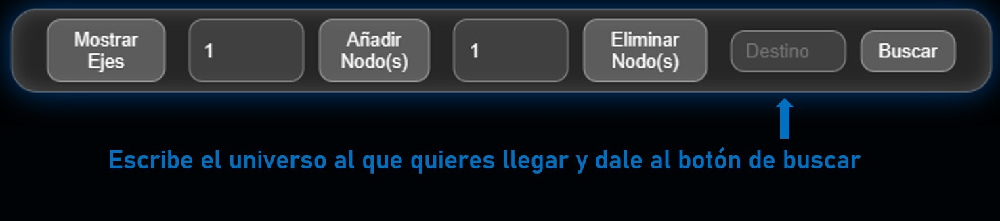

---
# Multiverso Toroidal

Simulación 3D de un **multiverso toroidal**, donde cada universo es representado como un nodo en un espacio tridimensional y se rige por un conjunto de reglas definidas para su correcto funcionamiento. El sistema implementa estructuras de datos personalizadas para gestionar la representación, las conexiones y el comportamiento de los universos.
Proyecto desarrollado para la clase de Estructuras de Datos.

---

## REGLAS

Estas reglas son **inmutables y obligatorias**, aplicadas desde la capa lógica:

1.  Se puede viajar entre universos, pero solo siguiendo conexiones existente.
2.  Cada universo puede conectarse máximo con 6 universos.
3.  Las conexiones son unidireccionales. Si viajas de A → B, no puedes devolver A ← B por esa misma conexión.
4.  El multiverso debe tener mínimo 36 universos. No se permite borrar por debajo de ese límite.
5.  Cada universo debe tener al menos 1 salida obligatoria.  Nunca quedan nodos aislados.
6.  Rutas pasadas se eliminan para dejar visible solo la última ruta generada.

---

## SIMULACION  

 **[Ver Simulacion](https://Jh-Seb.github.io/MULTIVERSO/)**

---

## MODO DE USO

El Multiverso Toroidal te permite agregar universos, eliminarlos y viajar entre ellos cumpliendo todas las reglas de conectividad y unidireccionalidad.
Usarlo es extremadamente sencillo.

Al abrir la simulación, esta inicia automáticamente con 36 universos mínimos, y nunca podrás tener menos de esa cantidad.
### **Agregar o eliminar universos**

 _(imagen 1)_
-Escribe en los campos numéricos cuántos universos deseas agregar o eliminar.
-Pulsa el botón correspondiente (Añadir Nodo(s) o Eliminar Nodo(s)).

El sistema ajustará automáticamente las conexiones internas respetando todas las reglas del multiverso.
Si intentas eliminar universos cuando solo existen 36, aparecerá un mensaje de error indicando que no pueden existir menos de 36 universos.

### **Viajar entre universos**
 _(imagen 2)_
- Escribe el ID del universo destino al que quieres llegar.
- Presiona el botón Buscar.

El sistema calculará la mejor ruta posible desde el universo de origen (por defecto, el 1) hasta el destino.
Durante la animación:

- Se dibuja la ruta paso a paso.
- Los universos se iluminan indicando el recorrido.
- La última ruta encontrada permanece visible en pantalla.

Importante:
No puedes regresar al mismo universo por la misma salida, ya que todas las conexiones son **unidireccionales**.
Si deseas regresar, el programa buscará otra ruta alternativa que cumpla las reglas del multiverso

---

## ARQUITECTURA DEL PROYECTO

El proyecto está organizado en módulos que dividen responsabilidad entre lógica, renderizado, geometría y reglas del multiverso.

### **Estructura general**

```
MULTIVERSO/
│
├src/
│├── logic/
││     ├── addUniverse.ts
││     ├── connectUniverses.ts
││     ├── removeUniverse.ts
││     └── routeFinder.ts
││ 
│├── types/
││    └── index.d.ts
│├── torus.ts
│├── controls.ts
│├── scene.ts
│├── universe.ts
│├── main.ts
│├── styles.css
│└── ui.ts
│
├── .gitignore
├── index.html
├── package.json
├── README.md
├── tsconfig.json
└── vite.config.ts
```
---
## CARACTERISTICAS DEL MULTIVERSO

### **1. Representacion 3D de una Figura Toroidal:**
Los universos están distribuidos en la superficie de un toro parametrizado:
- x = (R + r cos v) cos u
- y = (R + r cos v) sin u
- z = r sin v
### **2. Conexiones unidireccionales con reglas estrictas:**
- Nunca se crea la conexión inversa.
- Siempre se respetan las 6 salidas máximas.
- Eliminación de universos limpia todas las entradas relacionadas.

### **3. Rutado inteligente (BFS):**
-El algoritmo analiza camino mínimo en número de saltos.

---

## ESTRUCTURAS DE DATOS

El Multiverso Toroidal utiliza una arquitectura propia basada en **contenedores de universos** y **listas de conexiones unidireccionales**, diseñada para cumplir estrictamente con las reglas del modelo sin depender de estructuras tradicionales como grafos.
Toda la lógica se apoya en dos pilares:

- El contenedor global de universos
- Las conexiones internas de cada universo, que definen hacia dónde puede viajar.

### CONTENEDOR GLOBAL : _Map<number, Universo>_

El proyecto mantiene todos los universos dentro de un:

_**Map<number, Universo>**_

Esto actúa como un índice de acceso directo, ofreciendo:
- Acceso O(1) a cualquier universo dado su ID
- Actualización eficiente al agregar o remover universos
- Persistencia estructurada: cada universo vive como un objeto independiente

Cada entrada del mapa contiene un objeto:

```
{
  id: number
  position: THREE.Vector3
  connections: number[]
  mesh: THREE.Mesh
}
```
Este diseño convierte al Map en una especie de “atlas” dimensional del multiverso, donde cada universo está perfectamente localizado y accesible.

### CONEXIONES ENTRE UNIVERSOS:  _Arreglo de adyacencias implícito_

Cada universo mantiene un arreglo de salidas permitidas, que representa las dimensiones a las que puede viajar.

Propiedades clave del arreglo de conexiones:

- Máximo 6 salidas, cumpliendo la Regla #2
- Las salidas nunca se invierten automáticamente
(si A → B, eso NO significa que B → A)
- Son siempre unidireccionales, cumpliendo la Regla #3
- Acceso y edición O(1)
- Las conexiones se eliminan automáticamente si un universo desaparece

Esto nos permite mantener rutas coherentes y evitar bucles imposibles según las reglas del multiverso.


Cumpliendo:

- Máximo 6 salidas

- Nunca conexiones inversas automáticas

---

## ALGORITMO DE ENRUTAMIENTO

### **BFS (Breadth-First Search)**

Para encontrar una ruta válida entre dos universos, utilizamos un algoritmo clásico de exploración por capas, conocido como **Búsqueda en Anchura (BFS)**.
Este funciona de la siguiente manera: 

Cada universo contiene un arreglo interno

```
connections: number[]
```
que representa sus salidas unidireccionales hacia otros universos.
BFS explora estas salidas nivel por nivel, extendiéndose solo hacia universos accesibles y válidos.

El proceso consiste en:

1. Se inicia en el universo origen.

2. Se guarda este universo en una cola (queue) de pendientes por explorar.

3. Se tienen dos estructuras internas:

  - visited → evita repetir universos ya visitados.

  - parent → permite reconstruir la ruta final.

4. Mientras haya elementos en la cola:

  - Se toma el primer universo de la cola.

  - Si es el destino → termina la búsqueda.

  - Si no → se añaden a la cola todas las salidas de ese universo que:

    - No hayan sido visitadas antes.

    - Respeten la regla de unidireccionalidad.

5. Cuando se alcanza el destino:

  - Se reconstruye la ruta recorriendo los _parent[id]_ desde el final hasta el origen.

Esto nos garantiza que:
1. Encuentra la ruta mas corta
2. Cumple con la unidireccionalidad
3. Evita ciclos
4. Esta optimizado para una gran cantidad de universos

La complejidad de BFS en esta estructura es:
```
O(V + E)
```
Pero como cada universo tiene máximo 6 salidas, el comportamiento real es:
```
≈ O(n)
```
Donde n = número de universos existentes.

Esto hace al algoritmo extremadamente rápido incluso en simulaciones 3D.

---

## MATEMÁTICA DETRAS DEL PROYECTO

Nuestro Multiverso se basa en una representación matemática donde el espacio no es ni plano ni esférico, sino toroidal: una superficie en forma de donut.
Este tipo de espacio tiene propiedades únicas que lo hacen ideal para un multiverso con reglas estrictas de conectividad y dirección única.

### **1. GEOMETRIA TOROIDAL**

Para ubicar cada universo en 3D, usamos la parametrización clásica del toro:

$$
\begin{align}
x &= (R + r \cos v) \cos u \\
y &= (R + r \cos v) \sin u \\
z &= r \sin v
\end{align}
$$


Donde:

- R → radio mayor (el que va del centro del donut al centro del “tubo”)
- r → radio menor (radio del tubo)
- u, v → variables angulares en [0,2π]

### **2. CONTINUIDAD ESPACIAL TOTAL**

El toro tiene una propiedad importante:

  - Salir por un borde implica aparecer por el lado contrario.

Esto significa que el espacio:

- No tiene bordes
- No tiene paredes
- No tiene extremos

Para el multiverso, esta geometría encaja con las reglas, pues:

- Permite conexiones direccionales libres sin generar paredes o límites artificiales.
- Facilita que cada universo tenga hasta 6 salidas hacia otros vecinos naturales del toro.
- Evita concentraciones de nodos que rompan la estética o las distancias.

### **3. VECINDAD MATEMÁTICA RESPONSABLE**

Cada universo calcula su vecindad a partir de una métrica simple:
$$
d(a,b) = \sqrt{(x_a - x_b)^2 + (y_a - y_b)^2 + (z_a - z_b)^2}
$$

Esto nos permite elegir conexiones hacia los universos más cercanos, garantizando que:

- Cada universo tenga un entorno estable.
- Se cumpla la regla de máximo 6 conexiones salientes.
- No se creen conexiones inversas automáticas.

La métrica genera un entramado espacial natural donde las relaciones emergen exclusivamente de la geometría toroidal.

### **4. DISTRIBUCIÓN ANGULAR DE UNIVERSOS**

Para colocar los universos equitativamente:
$$
\begin{align}
u &= \frac{2\pi i}{N} \\
v &= \frac{2\pi j}{N}
\end{align}
$$
donde:
* $N = \text{número total de universos}$
* $i, j = \text{índices obtenidos de operaciones modulares}$
* 
Esto produce:

- Una distribución homogénea
- Sin agrupaciones abruptas
- Sin zonas “vacías” en el toro
- Adaptabilidad cuando se crean o eliminan universos
  
---

## LENGUAJES Y TECNOLOGÍAS

- TypeScript

- Three.js

- Vite

- HTML5 / Canvas

- CSS3 (Glassmorphism + Neon)

---


---
